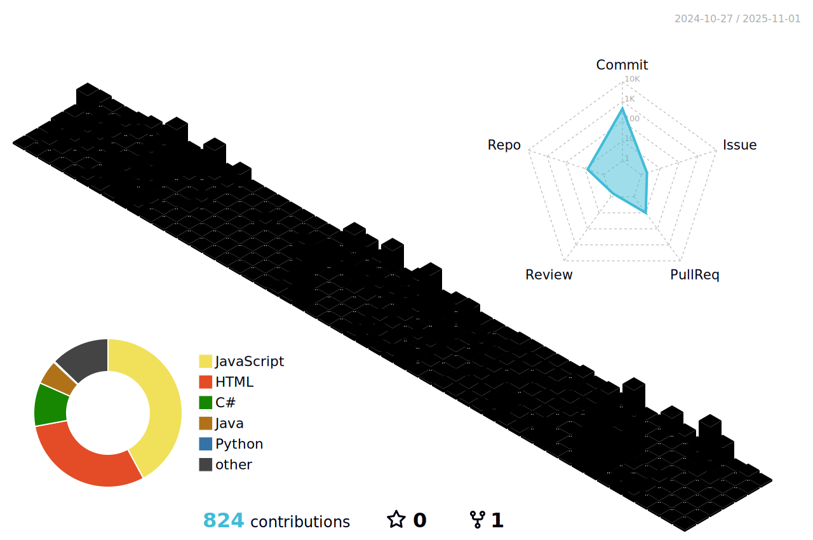

  <h3 align="center">
  Welcome to Jin's profile!
  
</h3>

<!--- https://readme-typing-svg.herokuapp.com --->

 

  

  
  
  

---

  
### :technologist: About Me
I am a passionate Full Stack Developer from China with a focus on building robust and user-friendly web applications.

- 🔭 I’m currently working as a Software Engineer, contributing to both frontend and backend development.
- 🌱 I’m always learning and exploring new technologies, and enjoy writing technical content.
- ⚡️ Outside of coding, I love riding and embracing new challenges.
- 📫 How to reach me: 

---

### 🚀 Featured Projects

<table width="100%" border="0" cellspacing="0" cellpadding="0">
<tr>
<td width="50%" valign="top">
<h3 align="center">UniRankHub</h3>

A university ranking comparison platform with custom weighting algorithms, aggregating data from multiple official sources.

<a href="http://www.unirankhub.com/" target="_blank"><strong>Live Demo</strong></a> | <a href="https://github.com/Flowers2Algernon" target="_blank"><strong>View on GitHub</strong></a>

<em>React, Next.js, Supabase</em>

</td>
<td width="50%" valign="top">
<h3 align="center">SecureShare AI</h3>

An end-to-end encrypted file sharing application using a hybrid RSA/AES encryption scheme.

<a href="http.safesend.me/" target="_blank"><strong>Live Demo</strong></a> | <a href="https://github.com/Flowers2Algernon/Secure-File-Transfer" target="_blank"><strong>View on GitHub</strong></a>

<em>Python, Cryptography, RSA, AES</em>

</td>
</tr>
</table>

---

### :hammer_and_wrench: Languages and Tools

<table>
  <tr>
    <td align="center" width="120">
      <strong>Frontend</strong>
    </td>
    <td>
      &nbsp;
      &nbsp;
      &nbsp;
      &nbsp;
      &nbsp;
      &nbsp;
      &nbsp;
    </td>
  </tr>
  <tr>
    <td align="center">
      <strong>Backend</strong>
    </td>
    <td>
      &nbsp;
      &nbsp;
      &nbsp;
      &nbsp;
      &nbsp;
      &nbsp;
    </td>
  </tr>
  <tr>
    <td align="center">
      <strong>Databases</strong>
    </td>
    <td>
      &nbsp;
      &nbsp;
      &nbsp;
    </td>
  </tr>
  <tr>
    <td align="center">
      <strong>Cloud & DevOps</strong>
    </td>
    <td>
      &nbsp;
      &nbsp;
      &nbsp;
    </td>
  </tr>
</table>

---

📈 My GitHub Stats

 
<a href="https://github.com/yoshi389111/github-profile-3d-contrib">
<picture>
  <source media="(prefers-color-scheme: dark)" srcset="https://github.com/Flowers2Algernon/Flowers2Algernon/blob/main/profile-3d-contrib/3d-contrib-profile-night.svg">
  
</picture>
</a>

<a href="https://github.com/ashutosh00710/github-readme-activity-graph">
<picture>
  <source media="(prefers-color-scheme: dark)" srcset="https://github-readme-activity-graph.vercel.app/graph?username=Flowers2Algernon&bg_color=00000f&color=007bff&line=fac539&point=FFFFFF&hide_border=true">
  
</picture>
</a>

<a href="https://github.com/denvercoder1/github-readme-streak-stats">
<picture>
  <source media="(prefers-color-scheme: dark)" srcset="https://github-readme-streak-stats.herokuapp.com?user=Flowers2Algernon&theme=java-dark&hide_border=true&card_width=1000.svg#gh-dark-mode-only">
  
</picture>
</a>

<a href="https://github.com/Flowers2Algernon/github-status">
<picture>
  <source media="(prefers-color-scheme: dark)" srcset="https://github.com/Flowers2Algernon/github-status/blob/master/generated/overview.svg#gh-dark-mode-only">
  
</picture>
</a>

<a href="https://github.com/Flowers2Algernon/github-status">
<picture>
  <source media="(prefers-color-scheme: dark)" srcset="https://github.com/Flowers2Algernon/github-status/blob/master/generated/languages.svg#gh-dark-mode-only">
  
</picture>
</a>

<b>Note:</b> Top languages is only a metric of the languages my public code consists of and doesn't reflect experience or skill level.
 

### :writing_hand: Blog Posts :

<!-- BLOG-POST-LIST:START -->
- [Database connection issues when deploying c# to railway](https://flowers2algernon.github.io/posts/Database-Connection-Issues-When-Deploying-C-to-Railway/)
- [2025 年中总结及年尾展望](https://flowers2algernon.github.io/posts/2025-%E5%B9%B4%E4%B8%AD%E6%80%BB%E7%BB%93%E5%8F%8A%E5%B9%B4%E5%B0%BE%E5%B1%95%E6%9C%9B/)
- [Javascript and react basic](https://flowers2algernon.github.io/posts/JavaScript-and-React-Basic/)
- [Network service](https://flowers2algernon.github.io/posts/Network-Service/)
<!-- BLOG-POST-LIST:END -->

<!---
Flowers2Algernon/Flowers2Algernon is a ✨ special ✨ repository because its `README.md` (this file) appears on your GitHub profile.
You can click the Preview link to take a look at your changes.
--->
